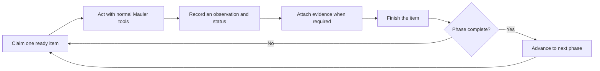

# Engagement Grid operator guide

Date: 2026-07-14

Status: functional beta. The core workflow is real and durable, and the guided setup wizard is
available. Final authorised live-smoke hardening is still in progress.

## What the Grid is

The Engagement Grid is the shared testing checklist used by you and the Mauler agent. It remembers the authorised target, the current phase, completed checks, discovered endpoints, observations, evidence, and findings.

You do not have to operate the low-level state machine manually. Your normal job is to:

1. configure the project and authorised target;
2. create or resume its Grid;
3. tell the agent to continue the Grid;
4. review progress, evidence, and findings.

The agent handles the internal loop:

The Grid, not the chat transcript or Plan popover, is the source of truth for an active engagement.

## First run: the shortest safe path

### 1. Create or open a project

Open **Home**.

- For a new target, click **+ New HTB box**.
- For an existing target, select it from **Your boxes**.
- Click **Edit details**.

At minimum, set:

- **Name**: the box, lab, or client-project name;
- **Agent root folder**: the workspace where notes and evidence will live;
- **Target IP / URL** or **Hostname**: the authorised target.

Click **Save & open** or **Save & resume**. Opening the project makes its workspace and target context active.

### 2. Use guided setup

On the active project's Home page, find **Engagement grid** and click **Guided setup**. You can also
open **Grid** and click **Start guided setup**.

The wizard walks through six short checks:

1. confirm the active project and workspace;
2. preview the target and hostname that will become immutable locked scope;
3. select the bundled **Web App (Simple)** workflow and reviewed 20-check OWASP pack;
4. review candidate notes, scans, screenshots, reports, and artifacts already in the workspace;
5. run provider and target-readiness checks; and
6. create the Grid, then either open it or prepare the first run in Chat.

Existing files are passed to the first-run draft only as untrusted historical candidates. Their
contents are not silently copied into the Grid, and file existence never completes a check. The
agent must inspect and verify useful material before attaching it as evidence.

The target reachability check is advisory because Windows may not share the same VPN/WSL route as
the agent shell. A failed active-provider check blocks **Start first run**, but it does not prevent
you from creating and inspecting the Grid.

If the target is wrong, correct the project first. The current Grid scope cannot be edited after it is locked; delete only the Grid and recreate it after correcting the project. Deleting a Grid does not delete workspace files or RunLedger evidence.

### 3. Open the Grid and check the next action

Click **Open Grid**, or use the **Grid** navigation item.

Before starting a run, check:

- the correct engagement is selected on the left;
- **Locked scope** contains only the authorised target and hostname;
- the phase rail begins at **Reconnaissance** for a new Grid;
- **Deterministic next action** names one ready task;
- there is no unexpected active claim.

### 4. Start the agent from Chat

From the final wizard step, click **Start first run**. This opens Chat with a prepared, editable
prompt; it does not send or run anything automatically. Review it and press Send when ready.

For an existing Grid, click **Ask agent to continue** or **Continue in Chat**. Then send:

> Continue the active Engagement Grid. Take the next safe item, work only inside the locked scope, attach useful evidence, and keep going until you need my input or reach a real blocker.

Every new run receives a fresh compact Grid packet automatically. You should not need to paste workflow JSON, checklist text, or old chat history.

### 5. Watch without steering every internal step

The agent should claim one ready item, use normal Mauler tools, record the result, finish it, and move to the next legal item. The Grid refreshes from the same SQLite state used by the agent.

Useful places to watch are:

- **Grid > Workflow** for the current phase, claim owner, next action, and available queue;
- **Stream** for current model activity;
- **AI Commands** for grouped tool calls;
- **Terminal** for raw terminal output;
- **Brain/Logs** when diagnosing a failed or repeated action.

### 6. Review endpoints, evidence, and findings

As reconnaissance discovers routes:

- **Endpoints** lists and groups them, with per-route checks;
- **Evidence** stores pointers and hashes for files, screenshots, HTTP captures, or RunLedger events;
- **Findings** contains reportable issues.

Raw response bodies remain in artifacts or RunLedger. The Grid stores provenance rather than copying large evidence bodies into every model prompt.

### 7. Stop and resume safely

Stopping the agent does not lose Grid progress. A clean stop releases unfinished claimed work. If the app crashes, the claim lease expires and the item becomes available again.

To resume later:

1. open the same project on **Home**;
2. click **Open Grid** on its resume card;
3. inspect the next action;
4. click **Ask agent to continue** and use the continuation prompt above.

## What each Grid section means

| Section | Use it for | Avoid putting here |
| --- | --- | --- |
| **Workflow** | Current phase, next action, claims, queue, progress, and locked scope | Raw terminal logs |
| **Checklist** | Whole-application security checks | Per-route testing |
| **Endpoints** | Discovered routes, feature groups, and per-endpoint checks | Unconfirmed guesses |
| **Notes** | Target model, roles, trust boundaries, hypotheses, and highest-value risks | A chronological command diary |
| **Evidence** | Provenance pointers to raw proof | Unsupported conclusions |
| **Findings** | Reproducible, evidenced vulnerabilities | Scanner output that has not been verified |

## Statuses in plain English

- `passed`: the check was performed and the expected protection held.
- `warning`: something deserves attention, but the evidence does not yet prove a vulnerability.
- `vulnerable`: the weakness was reproduced and has the required raw evidence.
- `not_applicable`: the check genuinely does not apply; include a short reason.
- `skipped`: the work was deliberately not run; include a short reason.
- `failed`: the test itself could not be completed, such as a tool or reachability failure.
- `done`: a workflow/setup task was completed; security checks should normally use the more specific statuses above.

## Evidence and finding rules

- Evidence can be attached only while its work item has an active claim.
- A `vulnerable` result cannot finish without the evidence required by that check.
- A finding needs reproduction steps and raw evidence before it can be confirmed.
- Medium, high, and critical findings need screenshot evidence or an explicit operator waiver explaining why a screenshot is unsuitable.
- The agent may draft a finding, but unsupported drafts must remain unconfirmed.

These gates are intentional. They stop a scanner hint or model guess from becoming a finished vulnerability.

## When the Grid looks stuck

### “Set a target or hostname before creating a grid”

Return to **Home > Edit details**, set the authorised target or hostname, then save and open the project.

### “No unclaimed work is ready”

Check whether another live run owns the current claim. If the phase is complete, ask the agent to continue so it can advance. Refresh the Grid if a run just stopped.

### A dead run still owns the item

Wait for the lease countdown to expire, or use **Release** only when you know the claimant is no longer running. Releasing returns unfinished work to the queue.

### Evidence or finding controls are disabled

Those controls are tied to the actively claimed work item. Start or resume the agent so it claims the relevant item first.

### An endpoint is rejected as out of scope

Do not work around the guard. Confirm the project target and Grid scope. If the project was configured incorrectly, correct it and recreate the Grid.

### The same command appears repeatedly

Stop the run and inspect **AI Commands**, **Logs**, and **Brain**. Preserve the Grid state, report the repeated tool/result pattern, and resume only after the cause is understood.

## Export and import

**Export JSON** copies a portable, schema-versioned Grid snapshot. It contains pinned workflow/checklist identity and portable evidence pointers, not duplicated raw evidence bodies.

**Import JSON** verifies definition digests, assigns the current workspace as authoritative, rejects escaping evidence paths, and clears stale live claims. Keep the referenced artifacts with the workspace when moving a Grid.

## Current beta limits

The following are not complete yet:

- operator editing of completed work results and repeat counts;
- best-effort scope inspection for arbitrary shell commands and full browser-action scope enforcement;
- the allowlisted remote check-pack update and approval UI;
- independent final-review enforcement;
- authorised live smoke runs against a local vulnerable fixture and an HTB target.

## Guided setup flow

The current setup wizard uses this sequence:

1. **Project** - confirm the active workspace and project name.
2. **Target** - preview the target/hostname that will become locked scope.
3. **Workflow** - choose a workflow pack; initially the reviewed Web App workflow.
4. **Existing work** - preview scans, notes, screenshots, and reports that can be indexed as candidate evidence without marking checks complete.
5. **Ready check** - show model/provider, shell, VPN, target reachability, and scope warnings.
6. **Create and run** - create the Grid, open it, or use **Start first run** to prepare the continuation prompt in Chat.

The wizard discovers candidate artifact paths without reading their contents during setup. A later
slice may add durable pre-run indexing, but it must preserve the same verify-before-evidence rule.
